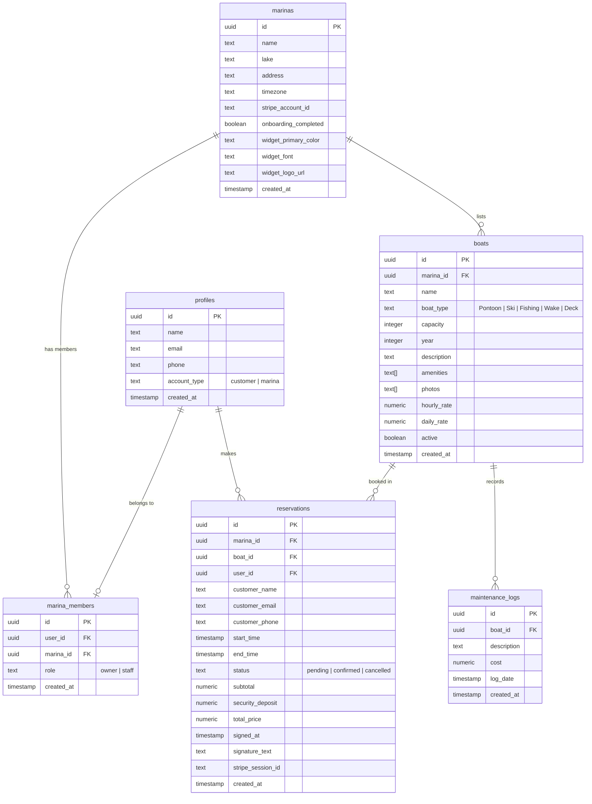

# ⛵ Lake Pass

**Lake Pass** is a real-time boat rental reservation platform built for marinas and lake enthusiasts. It serves two core user groups:
1. **Customers**: Looking to browse, check real-time availability, book boats instantly, sign digital waivers, and enjoy their day on the water.
2. **Marina Operators**: Seeking a single, integrated hub to list their fleet, manage reservation calendars, configure custom styles for booking widgets, handle online payouts, track maintenance, and send automated notifications.

---

## 🛠️ Technology Stack & Integrations

Lake Pass utilizes a modern, robust, and type-safe stack:

### Frontend & SSR (Server-Side Rendering)
- **Framework**: [React 19](https://react.dev/) — Utilizing the latest React features and optimizations.
- **SSR & Router**: [TanStack Start](https://tanstack.com/router/latest/docs/framework/react/start/overview) — Combining file-based routing with robust server functions (`createServerFn`) and unified API calls.
- **Routing**: [TanStack Router](https://tanstack.com/router) — Fully type-safe routing with search parameter validation.
- **Data Fetching & Caching**: [TanStack Query v5 (React Query)](https://tanstack.com/query) — State management for remote data with caching, query invalidation, and optimistic updates.
- **Styling**: [Tailwind CSS v4](https://tailwindcss.com/) (using `@tailwindcss/vite` plugin) and [Lucide React](https://lucide.dev/) for iconography.
- **UI Components**: Built on [Radix UI](https://www.radix-ui.com/) primitives (styled via shadcn/ui conventions).

### Backend & Database
- **Core Backend**: [Supabase](https://supabase.com/) — Providing PostgreSQL database storage, authentication, and Row-Level Security (RLS) policies.
- **Database Migrations**: Managed via the Supabase CLI (`supabase/migrations`).

### Third-Party APIs & Services
- **Stripe / Stripe Connect**:
  - Facilitates payments using checkout sessions.
  - Utilizes **Stripe Connect Express** for marina onboarding, routing payouts directly to operators with a platform application fee (5% split).
- **SendGrid**:
  - Handles booking confirmation emails detailing reservation times, prices, and links to sign waivers.
- **Twilio**:
  - Sends SMS reminders to customers, ensuring they sign their digital waiver before arriving at the dock.
- **Weather API**:
  - Fetches real-time weather logs on the marina dashboard to assist operators in coordinating dock activities.

---

## 📂 Project Structure

```
├── .env                         # Local environment configuration
├── package.json                 # Dependency definitions and dev/build scripts
├── tsconfig.json                # TypeScript settings
├── vite.config.ts               # Vite bundler options with TanStack Router/Start plugins
├── supabase/                    # Supabase database config & migrations
│   ├── config.toml              # Supabase project configurations
│   └── migrations/              # SQL files defining schemas, triggers, and seed data
└── src/
    ├── main.tsx                 # App entry point
    ├── routeTree.gen.ts         # Automatically generated TanStack Route tree
    ├── router.tsx               # Instantiates TanStack Router with React Query support
    ├── start.ts                 # Dev server configuration
    ├── server.ts                # Production/API handler server configuration
    ├── styles.css               # Global stylesheets containing custom color themes
    ├── assets/                  # Images and static media (e.g., hero backgrounds)
    ├── components/              # UI widgets and layouts
    │   ├── header.tsx           # Global navigation header
    │   ├── dashboard-shell.tsx  # Layout wrapper for the Marina Dashboard
    │   └── ui/                  # Component library (Buttons, Dialogs, Selects, etc.)
    ├── hooks/                   # Custom utility React hooks
    ├── integrations/            # Supabase API clients and database helper scripts
    │   └── supabase/            # Client, client-server client, auth middleware/attachers
    ├── lib/                     # System utilities & API integrations
    │   ├── utils.ts             # Tailwind class merging helper
    │   ├── public-catalog.ts    # Queries for browsing public listings
    │   ├── marina-queries.ts    # React queries for fetching profiles and marina info
    │   └── api/
    │       ├── communications.server.ts # Server functions for Twilio SMS & SendGrid Mail
    │       └── stripe.functions.ts      # Server functions for Stripe & Marina Onboarding
    └── routes/                  # File-based routing configuration
        ├── __root.tsx           # Layout root rendering context providers (Query/Auth/Toasts)
        ├── index.tsx            # Landing page containing search and marketing panel
        ├── auth.tsx             # Login / Sign up controls using Supabase auth
        ├── browse.tsx           # Filtered listings (lakes, capacity, boat types)
        ├── boat.$boatId.tsx     # Boat view details page and checkout modal
        ├── waiver.$reservationId.tsx # Digital waiver signature canvas page
        └── _authenticated/      # Route group enforcing user authentication
            ├── route.tsx        # Authentication checks and redirection rules
            ├── onboarding.tsx   # Step-by-step setup wizard for marina owners
            ├── dashboard.tsx    # Interactive management control panel for operators
            └── welcome.tsx      # Welcome / Account switch landing page
```

---

## 🗄️ Database Architecture

Below is the database entity-relationship representation mapping how users, marinas, boats, and rentals correspond:



---

## 🔄 Core Workflows & How They Work

### 1. Marina Onboarding Flow
To start renting out boats, a marina representative completes a multi-step onboarding process:
1. **Profile Setup**: Submits marina details (Name, Lake Location, Timezone). This creates a record in the `marinas` table and ties the user in `marina_members`.
2. **Fleet Builder**: Owners define their fleet details (Name, type, capacity, rates). The onboarding step supports uploading photos and listing amenities.
3. **Stripe Connect Onboarding**: The app redirects the user to Stripe's onboarding interface via a generated express login URL. If local credentials are not configured, the system simulates Stripe integration, assigning a mock account key.
4. **Widget Customization**: Marina owners choose the primary styling color, fonts, and logos for embedding widgets, updating their settings dynamically.
5. **Dashboard Access**: Upon finishing, `onboarding_completed` is set to `true`, and the operator is redirected to their management dashboard.

### 2. Booking & Payment Workflow
When a customer wants to book a day on the water:
1. **Search**: Browses listings by selecting a specific lake, boat type, and headcount on the landing search bar.
2. **Checkout Initiation**: On clicking "Book Now" for a specific boat, a modal collects their name, email, phone, and desired hours.
3. **Checkout Session Creation**: The app triggers `createCheckoutSession` (server function). It:
   - Calculates the booking fee (`hourly_rate * hours`) and adds a refundable security deposit ($250).
   - Generates a `pending` reservation in the database.
   - Creates a Stripe Checkout Session. If the marina has a connected Stripe account, a 5% platform application fee is deducted, and the remaining 95% goes directly to the marina.
4. **Payment Redirection**: The browser redirects the customer to Stripe Checkout.
5. **Payment Completion & Confirmation**:
   - On successful payment, Stripe redirects back to the boat page with query params.
   - The app updates the reservation status to `confirmed`.
   - The app executes `sendBookingConfirmation` (SendGrid) which emails the receipt and a link to the digital waiver (`/waiver/$reservationId`).
   - If a phone number was supplied, `sendSMSReminder` (Twilio) triggers an SMS reminder to sign the waiver.

### 3. Digital Waiver Signing Flow
Before checking in at the marina dock, customers must sign a waiver:
1. The email or SMS contains a unique waiver link pointing to `/waiver/:reservationId`.
2. The customer reviews the rental terms and signs:
   - Using a **Signature Canvas** (mouse drawing or finger touch-swiping).
   - Typing their legal name.
3. Submitting the form updates `reservations` in real-time, checking off `signed_at` and storing `signature_text`, which updates the marina operator's dashboard.

---

## ⚡ Setup & Local Development

Follow these steps to run the project locally on your machine:

### Prerequisites
Make sure you have [Node.js](https://nodejs.org/) (v18+) and [Supabase CLI](https://supabase.com/docs/guides/cli) installed. You can use standard package managers like `npm`, `yarn`, or `bun`.

### 1. Clone & Install Dependencies
```bash
git clone <repository-url>
cd boat-zen-desk-main
npm install
```

### 2. Configure Environment Variables
Create a `.env` file in the project root. If you don't have active keys for Stripe, Twilio, or SendGrid, the application will fallback to **Simulated Mode** logging transactions in your terminal:

```ini
# Supabase Configuration
SUPABASE_PROJECT_ID="your-project-id"
SUPABASE_PUBLISHABLE_KEY="your-publishable-anon-key"
SUPABASE_URL="https://your-project-id.supabase.co"
SUPABASE_SERVICE_ROLE_KEY="your-service-role-key"

# Vite Supabase Clones (Required for client-side client)
VITE_SUPABASE_PROJECT_ID="your-project-id"
VITE_SUPABASE_PUBLISHABLE_KEY="your-publishable-anon-key"
VITE_SUPABASE_URL="https://your-project-id.supabase.co"

# Payments & Communications (Optional - simulation is used if omitted)
STRIPE_SECRET_KEY="sk_test_..."
SENDGRID_API_KEY="SG.your-key"
SENDGRID_SENDER="no-reply@yourdomain.com"
TWILIO_ACCOUNT_SID="AC..."
TWILIO_AUTH_TOKEN="your-auth-token"
TWILIO_PHONE_NUMBER="+15005550006"
```

### 3. Setup Database (Supabase)
If running a local Supabase environment:
```bash
# Start local supabase services
supabase start

# Apply SQL migrations to set up schema and mock data
supabase db push
```

### 4. Run the Dev Server
Start the Vite developer build containing live reloading and TanStack Router watch mode:
```bash
npm run dev
```
Open [http://localhost:3000](http://localhost:3000) in your browser.
